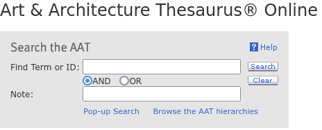

## Art & Architecture Thesaurus (AAT)

Der seit 1970s existierende [AAT](https://www.getty.edu/research/tools/vocabularies/aat/) bietet ein kontrolliertes Vokabular für Konzepte aus dem Bereich der Kunst und Architektur oder allgemein des materiellen Kulturerbes.

Der AAT gliedert sich in acht Facetten:

1. Associated Concepts
2. Physical Attributes
3. Styles and Periods: z.B. Kunst- und Stilrichtungen, Perioden
4. Agents: z.B. Berufsgruppen
5. Activities: jedwede Art von Tätigkeit von Personen oder Dingen, z.B. Malen oder Rosten
6. Materials: z.B. Holz, Elfenbein.
7. Objekte/Objects ([ID: 300264092](https://www.getty.edu/vow/AATFullDisplay?find=sculpture&logic=AND&note=&page=1&subjectid=300264092))
8. Brand Names

Jeder Eintrag im AAT enhält mindestens

- eine numerische ID
- einen Bezeichner (term)
- eine Angabe über die Position in der Hierarchie

Der AAT ist polyhierarchisch strukturiert, ein Element kann also an verschiedenen Stellen in einer Hierarchie auftauchen.

Das Konzept [*ceremonial weapons*](http://vocab.getty.edu/page/aat/300263273) steht z.B. unter *weapons* und *ceremonial objects*.

Jeder Eintrag im AAT ist über einen Seitenlink aufrufbar.
Dieser Link setzt sich aus einem Pfad (`http://vocab.getty.edu/page/aat/`) und der numerischen ID zusammen.
Der Link für einen Taschenrechner (*desktop calculator*, AAT-ID: 300424523) ist somit:

<http://vocab.getty.edu/page/aat/300424523>

Der AAT ist besonders ist speziell auf die Herausforderungen der Dokumentation von Kunst und Architektur ausgerichtet.
 
## Benutzung des AAT

Die Begriffssuche im [AAT] über zwei unterschiedliche Wege.

Eine **Suchmaske** erlaubt die Suche nach Bezeichnern bzw. IDs oder nach Wörtern im Anmerkungsteil.

Über den Link ["Browse the AAT hierarchies"](https://www.getty.edu/vow/AATHierarchy?find=&logic=AND&note=&english=N&subjectid=300000000) gelangt man zu einem systematischen Einstieg über die AAT-Hierarchie (vgl. oben).
Um tiefer in der Hierarchie hinabzusteigen, muss auf dieses Symbol am linken Seitenrand geklickt werden: . 
Ein Klick auf den Term selbst öffnet den entsprechenden Eintrag.

Wenn ein Element aus dem AAT in einer Objektbeschreibung verwendet wird, sollte stets der Datensatz-URI (<http://vocab.getty.edu/aat/ID>) verwendet werden.