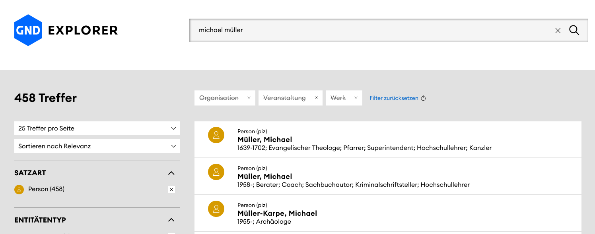
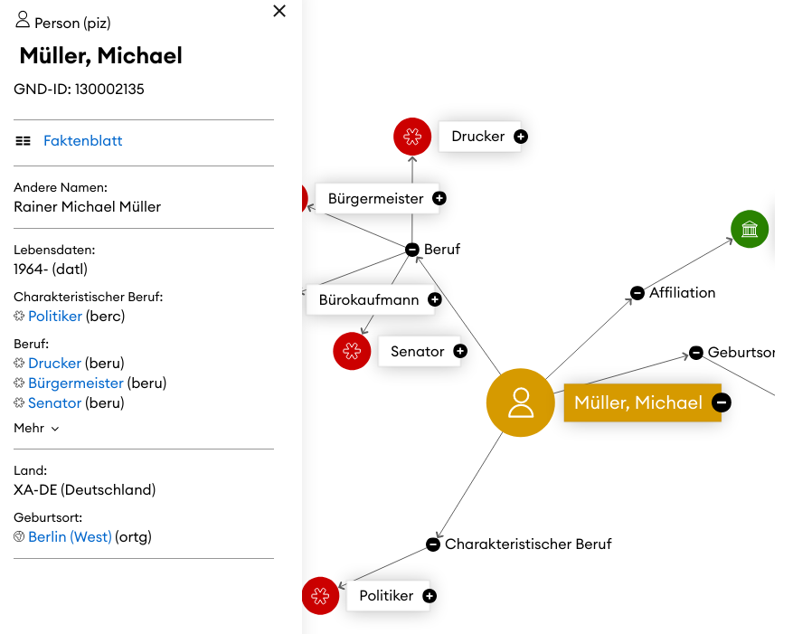

# Personennamen

Die eindeutige Auszeichnung von Personen ist für die Erschließung von großer Bedeutung.
Werke müssen einer bestimmten Person zugewiesen werden, auch wenn sich der Name der Person im Laufe der Zeit ändert, sich die Schreibweise wandelt, die jeweilige Person mehrere Namen verwendet oder aber verschiedene Personen desselben Namens existieren.

Es gibt mehrere etablierte Normdatenbanken für Personen bzw. Körperschaften.
Sie alle führen Namensformen und weitere Informationen zu einer bestimmten Person zu einem Datensatz zusammen.

## Gemeinsame Normdatei (GND)

Im deutschsprachigen Raum am weitesten verbreitet ist die im bibliothekarischen Kontext enstandene [Gemeinsame Normdatei](), die neben Personen und Körperschaften auch Schlagwörter und Geographhika führt.

Der [GND Explorer](https://explore.gnd.network) verzeichnet für [`"michael müller`](https://explore.gnd.network/search?term=michael%20m%C3%BCller&f.satzart.ex=Organisation&f.satzart.ex=Veranstaltung&f.satzart.ex=Werk&rows=25) 458 Treffer, d.h. unterschiedliche Personen dieses Namens:

Jeder der Treffer entsprich einem anderen Datensatz mit eigner GND-ID, sodass hierdurch Personen voneinander unterschieden werden können.

Der ehemalige Regierende Bürgermeister hat z.B. die GND-ID 130002135:

## Union List of Artist Names (ULAN)

Die ULAN verzeichnet speziell kunsthistorisch relevante Personen und Körperschaften.
Die Suche nach [*michael müller*](https://www.getty.edu/vow/ULANServlet?english=Y&find=michael+m%C3%BCller&role=&page=1&nation=) liefert entsprechend weniger Treffer (11).

Die ULAN-Einträge enthalten neben der ID einen Namen in der Ansetzungsform (bevorzugte Namensform) sowie weitere Informationen z.B. zu Geburts- und Sterbeort, Tätigkeiten, Nationalität und Bezug stehenden Personen. 

Vgl. etwa den Eintrag zu [Anna Maria van Schurman (ID 500017433)](http://vocab.getty.edu/page/ulan/500017433).

## The Virtual International Authority File (VIAF)

Der VIAF aggregiert zahlreiche Normdatenbanken.
Mit einem VIAF-Datensatz sind also Datensätze aus einer oder mehrerer Normdatenbanken verknüpft.

- Getty Thesaurus of Geographic Names (TGN): Orte, Ortstypen etc.

Development of the Getty Vocabularies: AAT, TGN, ULAN, and CONA